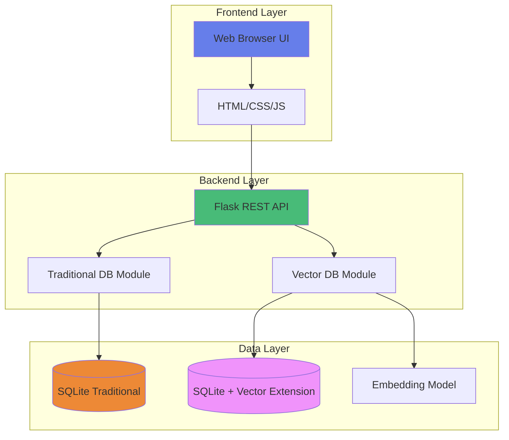
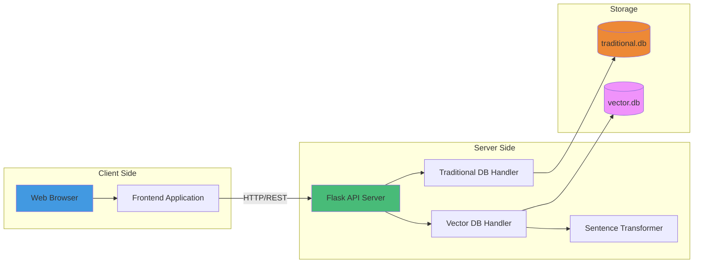
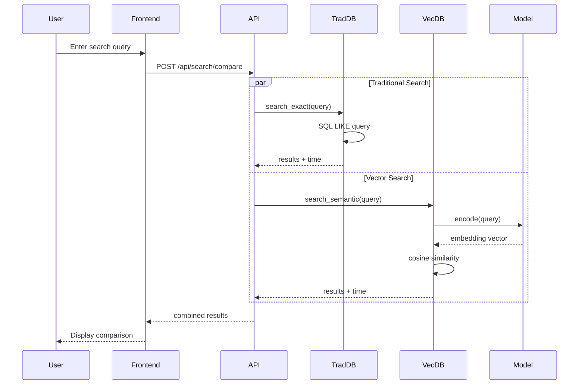
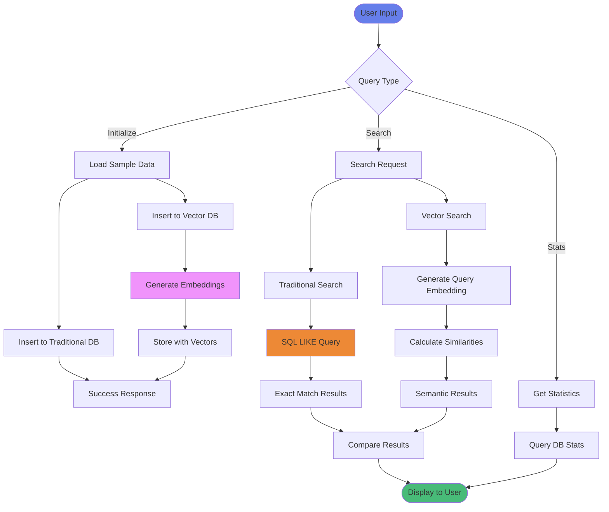
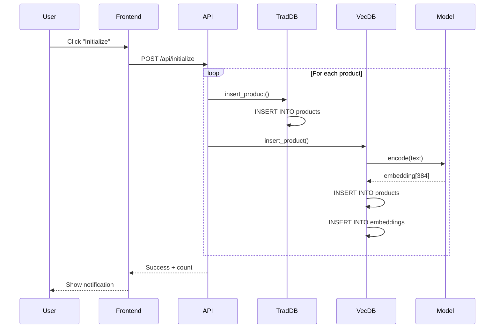
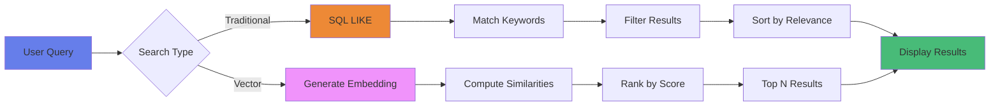

# Architecture Documentation

This document provides a comprehensive overview of the Vector DB vs SQL DB Comparison application architecture.

## Table of Contents

1. [System Overview](#system-overview)
2. [Architecture Diagrams](#architecture-diagrams)
3. [Component Details](#component-details)
4. [Data Flow](#data-flow)
5. [Database Design](#database-design)
6. [API Design](#api-design)
7. [Frontend Architecture](#frontend-architecture)
8. [Technology Stack](#technology-stack)

## System Overview

The application is a full-stack web application designed to demonstrate the differences between traditional SQL databases and vector databases through an interactive comparison interface.

### High-Level Architecture



## Architecture Diagrams

### System Architecture



### Component Interaction



### Data Flow Diagram



## Component Details

### 1. Frontend Layer

#### Components

**index.html**
- Main application interface
- Search input and controls
- Results display panels
- Statistics dashboard

**styles.css**
- Modern gradient design
- Responsive layout
- Component styling
- Animations and transitions

**app.js**
- API communication
- DOM manipulation
- Event handling
- Result rendering

#### Key Features

- Real-time search comparison
- Interactive example queries
- Performance metrics display
- Responsive design for all devices

### 2. Backend Layer

#### Flask API Server (app.py)

```python
# Core responsibilities:
- Route handling
- Request validation
- Database coordination
- Response formatting
- CORS management
```

**Endpoints:**

| Endpoint | Method | Purpose |
|----------|--------|---------|
| `/api/health` | GET | Health check |
| `/api/initialize` | POST | Load sample data |
| `/api/search/traditional` | POST | Traditional search |
| `/api/search/vector` | POST | Vector search |
| `/api/search/compare` | POST | Compare both |
| `/api/stats` | GET | Database statistics |
| `/api/clear` | POST | Clear all data |

#### Traditional Database Module (traditional_db.py)

```python
# Key methods:
- initialize_db()      # Create schema
- insert_product()     # Add product
- search_exact()       # SQL LIKE search
- get_stats()          # Statistics
```

**Search Strategy:**
- Uses SQL `LIKE` operator with wildcards
- Pattern: `%query%`
- Indexes on name and category
- Prioritizes name matches

#### Vector Database Module (vector_db.py)

```python
# Key methods:
- initialize_db()        # Create schema
- insert_product()       # Add with embedding
- _generate_embedding()  # Create vector
- search_semantic()      # Similarity search
- _cosine_similarity()   # Calculate similarity
```

**Search Strategy:**
- Generates query embedding
- Computes cosine similarity with all products
- Ranks by similarity score
- Returns top N results

### 3. Data Layer

#### Traditional Database Schema

```sql
CREATE TABLE products (
    id INTEGER PRIMARY KEY AUTOINCREMENT,
    name TEXT NOT NULL,
    description TEXT NOT NULL,
    category TEXT NOT NULL,
    price REAL NOT NULL,
    created_at TIMESTAMP DEFAULT CURRENT_TIMESTAMP
);

CREATE INDEX idx_products_name ON products(name);
CREATE INDEX idx_products_category ON products(category);
```

#### Vector Database Schema

```sql
CREATE TABLE products (
    id INTEGER PRIMARY KEY AUTOINCREMENT,
    name TEXT NOT NULL,
    description TEXT NOT NULL,
    category TEXT NOT NULL,
    price REAL NOT NULL,
    created_at TIMESTAMP DEFAULT CURRENT_TIMESTAMP
);

CREATE TABLE embeddings (
    product_id INTEGER PRIMARY KEY,
    embedding BLOB NOT NULL,
    FOREIGN KEY (product_id) REFERENCES products(id) ON DELETE CASCADE
);
```

## Data Flow

### Initialization Flow



### Search Flow



## Database Design

### Traditional Database

**Characteristics:**
- Row-based storage
- B-tree indexes
- Exact text matching
- Fast for specific queries

**Advantages:**
- Simple and predictable
- Fast exact matches
- Low storage overhead
- Well-understood technology

**Limitations:**
- No semantic understanding
- Requires exact keywords
- Misses related concepts
- Limited fuzzy matching

### Vector Database

**Characteristics:**
- Embeddings stored as BLOBs
- 384-dimensional vectors
- Cosine similarity search
- Semantic understanding

**Advantages:**
- Understands context
- Finds related items
- Works with synonyms
- Conceptual matching

**Limitations:**
- Higher computational cost
- More storage required
- Slower for exact matches
- Model dependency

### Embedding Model

**Model:** all-MiniLM-L6-v2

**Specifications:**
- Dimensions: 384
- Max sequence length: 256 tokens
- Model size: ~80MB
- Inference speed: ~50ms per query

**How it works:**
1. Text is tokenized
2. Tokens are encoded
3. Contextual embeddings generated
4. Mean pooling applied
5. Normalized vector output

## API Design

### RESTful Principles

- **Stateless**: Each request contains all necessary information
- **Resource-based**: URLs represent resources
- **HTTP Methods**: Proper use of GET, POST
- **JSON**: Standard data format
- **CORS**: Cross-origin support

### Request/Response Format

**Search Request:**
```json
{
  "query": "comfortable seating"
}
```

**Search Response:**
```json
{
  "traditional": {
    "results": [...],
    "execution_time": 2.5,
    "count": 3
  },
  "vector": {
    "results": [...],
    "execution_time": 85.3,
    "count": 5
  }
}
```

### Error Handling

```json
{
  "error": "Error message",
  "status": 400
}
```

## Frontend Architecture

### Design Pattern

**Architecture:** Component-based vanilla JavaScript

**Key Principles:**
- Separation of concerns
- Event-driven programming
- Async/await for API calls
- DOM manipulation
- State management via closures

### Component Structure

```
Frontend
├── UI Components
│   ├── Search Box
│   ├── Results Panels
│   ├── Statistics Dashboard
│   └── Notifications
├── API Client
│   ├── Fetch wrapper
│   ├── Error handling
│   └── Response parsing
└── Utilities
    ├── HTML escaping
    ├── Formatting
    └── Animations
```

## Technology Stack

### Backend

| Technology | Version | Purpose |
|------------|---------|---------|
| Python | 3.8+ | Programming language |
| Flask | 3.0.0 | Web framework |
| Flask-CORS | 4.0.0 | CORS support |
| SQLite | 3.x | Database engine |
| sqlite-vec | 0.1.1 | Vector extension |
| sentence-transformers | 2.2.2 | Embeddings |
| numpy | 1.26.2 | Numerical computing |

### Frontend

| Technology | Purpose |
|------------|---------|
| HTML5 | Structure |
| CSS3 | Styling |
| JavaScript ES6+ | Logic |
| Fetch API | HTTP requests |

### Development Tools

| Tool | Purpose |
|------|---------|
| Git | Version control |
| Bash | Automation scripts |
| Virtual Environment | Dependency isolation |

## Performance Considerations

### Optimization Strategies

1. **Database Indexing**
   - B-tree indexes on frequently queried columns
   - Improves traditional search performance

2. **Embedding Caching**
   - Model loaded once at startup
   - Embeddings stored as BLOBs
   - Reduces computation overhead

3. **Connection Pooling**
   - Single connection per database
   - Thread-safe operations
   - Reduced connection overhead

4. **Lazy Loading**
   - Frontend loads data on demand
   - Reduces initial page load
   - Improves user experience

### Scalability

**Current Limitations:**
- Single-threaded Flask development server
- In-memory model loading
- No caching layer
- Synchronous processing

**Production Improvements:**
- Use Gunicorn with multiple workers
- Implement Redis caching
- Add connection pooling
- Consider async processing

## Security Considerations

### Current Implementation

- CORS enabled for development
- No authentication required
- Input sanitization in frontend
- SQL injection prevention (parameterized queries)

### Production Recommendations

- Implement authentication
- Rate limiting
- Input validation
- HTTPS/TLS
- Restricted CORS origins
- Environment-based configuration

## Future Enhancements

### Potential Improvements

1. **Advanced Vector Search**
   - HNSW indexing for faster similarity search
   - Approximate nearest neighbors
   - Batch processing

2. **Enhanced UI**
   - Real-time search suggestions
   - Advanced filtering
   - Export results
   - Visualization of embeddings

3. **Additional Features**
   - User accounts
   - Custom datasets
   - Multiple embedding models
   - A/B testing framework

4. **Performance**
   - Caching layer
   - Async processing
   - Load balancing
   - Database sharding

## Conclusion

This architecture provides a solid foundation for demonstrating the differences between traditional and vector databases. The modular design allows for easy extension and modification while maintaining clear separation of concerns.

The system successfully showcases:
- Traditional SQL exact matching
- Vector-based semantic search
- Performance trade-offs
- Real-world use cases

For questions or contributions, please refer to the main README.md.